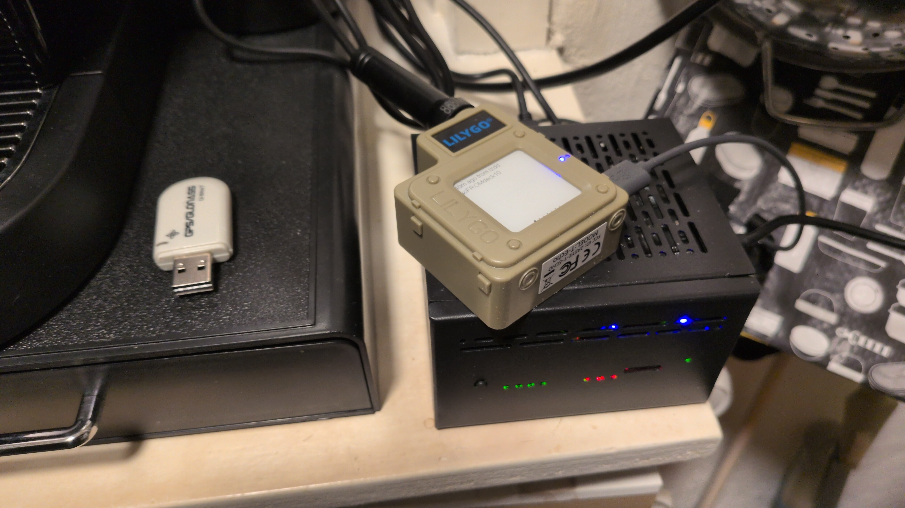
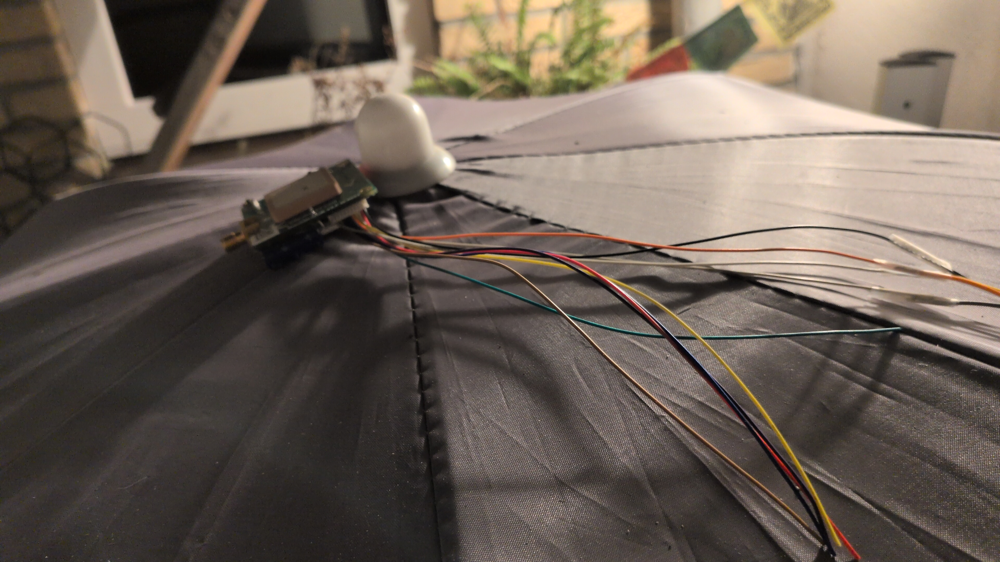

# MeshSat

[](https://gitlab.nuclearlighters.net/products/cubeos/meshsat/-/pipelines)

[](LICENSE)


MeshSat bridges Meshtastic mesh networks to multiple satellite and data channels from a single gateway. Iridium SBD, Astrocast LEO, cellular SMS, MQTT, and webhooks are all available as routing destinations. The bridge rules engine routes messages between any source and any destination without requiring code changes.

MeshSat runs as a standalone Docker container on any Linux machine with USB-connected devices. No cloud dependencies, no subscriptions beyond your satellite or cellular plan.

## Dashboard


*Built-in web dashboard showing Iridium status, mesh nodes, SOS controls,
SBD message queue, and GPS/satellite positioning*


*Satellite pass predictor with signal correlation --
optimizes transmission timing in obstructed environments*

## What It Does

- Bridges Meshtastic mesh radio to multiple satellite and data channels via configurable bridge rules
- Routes messages using a rules engine that supports any-to-any source/destination combinations
- Auto-detects USB devices on startup (no manual port configuration needed)
- Stores all messages, telemetry, GPS positions, and signal data in a local SQLite database
- Provides a built-in web dashboard for monitoring, sending messages, and managing devices
- Predicts satellite passes using SGP4/TLE propagation and schedules transmissions around optimal windows
- Manages a delivery queue with channel-specific retry and backoff (ISU-aware for Iridium)
- Exposes a REST API with 130+ endpoints for integration with other systems
- Runs on ARM64 (Raspberry Pi, BPI-M4 Zero) and x86_64 (Intel NUC, any PC)

## Deployment Modes

| | Standalone mode | CubeOS mode |
|---|---|---|
| Set via | `MESHSAT_MODE=direct` | `MESHSAT_MODE=cubeos` (default) |
| Serial access | Direct to /dev/ttyACM0, /dev/ttyUSB0 | Via HAL REST API |
| Deploy with | `docker-compose.standalone.yml` | CubeOS orchestrator |
| Who it's for | Any Linux machine | CubeOS installations |

This README covers standalone mode. For CubeOS mode, see [CubeOS docs](https://cubeos.app).

## Hardware


*Lilygo T-Echo (Meshtastic) connected to the MeshSat host with USB GPS dongle*


*RockBLOCK 9603 Iridium modem with patch antenna -- needs sky view for satellite access*

### Supported Devices

| Category | Device | Status | Notes |
|----------|--------|--------|-------|
| Meshtastic | Lilygo T-Echo (nRF52840) | Tested | 915 MHz, USB-C, end-to-end verified |
| Meshtastic | Espressif / CH340 / CP2102 / Nordic devices | Should work | Auto-detected via USB VID:PID |
| Satellite | RockBLOCK 9603 (Iridium 9603N) | Tested | RS-232 via USB adapter, 19200 baud |
| Satellite | Astrocast Astronode S | In Progress | Code complete, awaiting hardware for testing |
| Cellular | SIM7600G-H | In Progress | AT command driver complete, signal testing pending |
| Host | Raspberry Pi 5 | Tested | ARM64, 4 GB RAM, Debian Bookworm |
| Host | Raspberry Pi 4 | Should work | Same platform as Pi 5 |
| Host | BPI-M4 Zero | Planned | Armbian base, pending hardware verification |
| Host | Any x86_64 / ARM64 Linux | Should work | Docker + USB serial required |

## Quick Start

### Option A: One-liner with Docker

Pull the pre-built multi-arch image from GHCR and run it:

```bash
docker run -d \
  --name meshsat \
  --privileged \
  --network host \
  -e MESHSAT_MODE=direct \
  -e MESHSAT_PORT=6050 \
  -e MESHSAT_DB_PATH=/data/meshsat.db \
  -v meshsat-data:/data \
  -v /dev:/dev \
  -v /sys:/sys:ro \
  --restart unless-stopped \
  ghcr.io/cubeos-app/meshsat:latest
```

Open `http://<your-ip>:6050` in a browser to access the dashboard.

### Option B: Docker Compose

Save the following as `docker-compose.yml`:

```yaml
services:
  meshsat:
    image: ghcr.io/cubeos-app/meshsat:latest
    container_name: meshsat
    restart: unless-stopped
    privileged: true
    network_mode: host
    environment:
      - MESHSAT_MODE=direct
      - MESHSAT_PORT=6050
      - MESHSAT_DB_PATH=/data/meshsat.db
      # Auto-detects USB devices by default.
      # To pin specific ports, uncomment and set:
      # - MESHSAT_MESHTASTIC_PORT=/dev/ttyACM0
      # - MESHSAT_IRIDIUM_PORT=/dev/ttyUSB0
    volumes:
      - meshsat-data:/data
      - /dev:/dev
      - /sys:/sys:ro

volumes:
  meshsat-data:
```

Then run:

```bash
docker compose up -d
```

The dashboard will be available at `http://<your-ip>:6050`.

### Option C: Build from Source

```bash
git clone https://github.com/cubeos-app/meshsat.git
cd meshsat
docker compose -f docker-compose.standalone.yml up --build
```

## Setup Guide

### Step 1: Plug in your devices

Connect your Meshtastic radio and/or Iridium modem via USB. MeshSat will detect them automatically on startup. You can verify they appear:

```bash
ls /dev/ttyACM* /dev/ttyUSB*
```

Typical result: `/dev/ttyACM0` (Meshtastic) and `/dev/ttyUSB0` (Iridium). The exact names depend on your hardware and the order you plugged them in.

### Step 2: Start the container

Use one of the methods above (Docker one-liner or Docker Compose). MeshSat will:

1. Scan `/dev/ttyACM*` and `/dev/ttyUSB*` for known devices
2. Connect to each device it finds (Meshtastic handshake, Iridium AT probe)
3. Start the web dashboard and API on port 6050

Watch the startup logs to confirm detection:

```bash
docker logs meshsat
```

You should see lines like:

```
INF using direct serial transport mode=direct
INF meshtastic: connected to /dev/ttyACM0 nodes=12 myNode=0xABCD1234
INF iridium: connected imei=300434067943980 model=IRIDIUM 9600 Family SBD Transceiver
INF server started port=6050
```

### Step 3: Open the dashboard

Navigate to `http://<your-ip>:6050` in any browser. The dashboard shows:

- **Messages** -- live message feed from all connected devices
- **Nodes** -- mesh network nodes with signal quality and last-heard times
- **Map** -- node positions on a Leaflet map (if GPS data is available)
- **Telemetry** -- battery voltage, temperature, and other device metrics
- **Config** -- radio settings, gateway configuration, and bridge rules

### Step 4: Set up bridge rules

To route messages between channels, create bridge rules in the Config tab. Rules are direction-aware (outbound mesh-to-satellite, inbound satellite-to-mesh, or both) and the rules engine is the single authority for all forwarding decisions. A bridge rule specifies:

- **Source gateway** -- where messages come from (e.g., `meshtastic`)
- **Destination gateway** -- where messages go (e.g., `iridium`)
- **Direction** -- outbound, inbound, or both
- **Filter** -- optional: match specific channels, node IDs, or message types

Example: to forward all text messages from a specific Meshtastic node to Iridium SBD, create an outbound rule with the source node filter and destination set to your Iridium gateway.

### Step 5: Verify end-to-end

Send a test message from your Meshtastic device. If bridge rules are configured, it should appear in the RockBLOCK portal (or wherever your SBD messages are delivered). Send a message from the RockBLOCK portal back -- it should arrive on your Meshtastic device.

## Configuration

All configuration is via environment variables:

| Variable | Default | Description |
|----------|---------|-------------|
| `MESHSAT_MODE` | `cubeos` | Set to `direct` for standalone USB access |
| `MESHSAT_PORT` | `6050` | HTTP port for dashboard and API |
| `MESHSAT_DB_PATH` | `/data/meshsat.db` | SQLite database file path |
| `MESHSAT_MESHTASTIC_PORT` | `auto` | Serial port for Meshtastic (`auto` = scan USB) |
| `MESHSAT_IRIDIUM_PORT` | `auto` | Serial port for Iridium (`auto` = scan USB) |
| `MESHSAT_CELLULAR_PORT` | `auto` | Serial port for cellular modem (`auto` = scan USB) |
| `MESHSAT_RETENTION_DAYS` | `30` | Days to keep historical data |
| `MESHSAT_PAID_RATE_LIMIT` | `60` | Minimum seconds between paid gateway sends |
| `MESHSAT_WEB_DIR` | *(empty)* | Override embedded SPA path (development only) |
| `HAL_URL` | `http://10.42.24.1:6005` | HAL endpoint (CubeOS mode only) |

### Running with only one device

MeshSat works fine with just a Meshtastic radio (no Iridium) or just an Iridium modem (no Meshtastic). It will log a warning for the missing device and continue operating with whatever is connected.

### Pinning device ports

If auto-detection picks the wrong port (e.g., you have multiple USB-serial adapters), set the port explicitly:

```bash
-e MESHSAT_MESHTASTIC_PORT=/dev/ttyACM0
-e MESHSAT_IRIDIUM_PORT=/dev/ttyUSB1
```

### Why `--privileged`?

MeshSat needs raw access to USB serial devices (`/dev/ttyACM*`, `/dev/ttyUSB*`) and uses `stty` to configure baud rate and line discipline. The `--privileged` flag grants the necessary device permissions. The `/dev` and `/sys` bind mounts allow device enumeration and sysfs VID:PID lookups for auto-detection.

## API

MeshSat exposes a REST API on the same port as the dashboard. The major endpoint groups are listed below. Full API details are available at `http://<your-ip>:6050/api/` when MeshSat is running.

| Method | Path | Description |
|--------|------|-------------|
| GET | `/health` | Health check |
| GET | `/api/messages` | Paginated message history |
| GET | `/api/messages/stats` | Message counts by transport and type |
| POST | `/api/messages/send` | Send a text message to the mesh |
| DELETE | `/api/messages` | Purge all messages |
| GET | `/api/telemetry` | Time-series device telemetry |
| GET | `/api/positions` | GPS position history |
| GET | `/api/nodes` | Mesh nodes with signal quality |
| DELETE | `/api/nodes/{num}` | Remove a node |
| GET | `/api/status` | Connection status for all transports |
| GET | `/api/events` | Server-Sent Events stream |
| GET | `/api/gateways` | Gateway status and configuration |
| GET/PUT/DELETE | `/api/gateways/{type}` | Gateway config CRUD |
| POST | `/api/gateways/{type}/start` | Start a gateway |
| POST | `/api/gateways/{type}/stop` | Stop a gateway |
| POST | `/api/gateways/{type}/test` | Test a gateway |
| GET | `/api/iridium/signal` | Current Iridium signal strength |
| GET | `/api/iridium/signal/history` | Signal strength history |
| GET | `/api/iridium/passes` | Predicted satellite passes (SGP4/TLE) |
| POST | `/api/iridium/passes/refresh` | Refresh TLE data |
| GET | `/api/iridium/scheduler` | Pass-aware scheduler status |
| POST | `/api/iridium/mailbox/check` | Manual mailbox check |
| GET | `/api/iridium/credits` | Credit balance |
| GET | `/api/iridium/queue` | Queued SBD messages |
| GET | `/api/astrocast/passes` | Astrocast LEO pass predictions |
| GET | `/api/cellular/signal` | Cellular signal strength |
| GET | `/api/cellular/status` | Cellular modem status |
| POST | `/api/cellular/sms/send` | Send SMS message |
| POST | `/api/webhooks/inbound` | Receive inbound webhook |
| GET | `/api/webhooks/log` | Webhook delivery log |
| GET | `/api/deliveries` | Delivery ledger (all channels) |
| GET | `/api/deliveries/stats` | Delivery statistics |
| GET | `/api/rules` | List forwarding rules |
| POST | `/api/rules` | Create forwarding rule |
| GET/PUT/DELETE | `/api/rules/{id}` | Rule CRUD |
| GET | `/api/transport/channels` | Transport channel registry |
| POST | `/api/admin/reboot` | Reboot a remote mesh node |
| POST | `/api/admin/traceroute` | Traceroute to a mesh node |
| POST | `/api/config/radio` | Update radio configuration |
| POST | `/api/config/module` | Update module configuration |
| GET | `/api/neighbors` | Neighbor info from mesh |
| POST | `/api/sos/activate` | Activate SOS mode |
| GET | `/api/sos/status` | SOS status |
| GET | `/api/presets` | List preset messages |
| POST | `/api/presets/{id}/send` | Send a preset message |

Additional endpoints exist for contacts, canned messages, waypoints, position sharing, range tests, store-and-forward, geolocation, DynDNS, and cellular data management. The full list totals 130+ endpoints.

## CubeOS Integration

MeshSat also runs as a managed service inside [CubeOS](https://cubeos.app), where it uses HAL (Hardware Abstraction Layer) for device access instead of direct serial. Set `MESHSAT_MODE=cubeos` (the default) and provide `HAL_URL` to use this mode. This is handled automatically when deployed via CubeOS.

## Architecture

```
USB Devices             MeshSat Container                   Clients
-----------      --------------------------------      ----------------
                 |                                |
/dev/ttyACM0 -->-|  DirectMeshTransport            |
  (Meshtastic)   |    Serial framing + Protobuf    |-->  Web Dashboard
                 |                                |     (Vue SPA, port 6050)
                 |         Processor               |
                 |            |                    |-->  REST API
                 |       Rules Engine              |     (130+ endpoints)
                 |       (any-to-any)              |
                 |            |                    |-->  SSE Events
                 |      GatewayManager             |     (real-time updates)
                 |       |    |    |    |          |
/dev/ttyUSB0 -->-|  Iridium  MQTT  Cell  Webhook  |
  (Iridium)      |  Gateway  GW    GW    GW       |
                 |                                |
/dev/ttyUSB1 -->-|  Astrocast    Delivery Ledger  |
  (Cellular)     |  Gateway     (SQLite tracking) |
                 |                                |
                 |  SQLite DB (/data/meshsat.db)   |
                 --------------------------------
```

Each gateway implements a common interface and is managed by the GatewayManager. Adding a new channel requires implementing the Gateway interface and registering it -- no switch statements to update. The delivery ledger tracks per-message, per-channel lifecycle state with channel-specific retry and backoff.

## Troubleshooting

**No devices detected on startup**

Check that your USB devices are visible to the host:
```bash
ls -la /dev/ttyACM* /dev/ttyUSB*
```
If nothing shows up, the USB cable or adapter may be faulty. Try a different port or cable.

**Meshtastic connects but shows 0 nodes**

The config handshake takes 5-10 seconds. Wait for the "config complete" log line. If nodes still don't appear, verify the radio is joined to a mesh network (configure via the Meshtastic app first).

**Iridium signal shows 0 bars**

Check antenna connections. The RockBLOCK 9603 requires a clear view of the sky and a properly connected antenna. If using an external antenna with a u.FL pigtail, verify the connector is seated firmly.

**SBDIX failures or timeouts**

Iridium SBD sessions (SBDIX) take 10-60 seconds and require signal strength of at least 2 bars. MeshSat rate-limits SBDIX to one session per 10 seconds. If messages are queuing in the dead letter queue, check signal strength and antenna placement.

## Roadmap

**v0.1.x (current)** -- Iridium SBD + Meshtastic bridge with configurable rules engine, MQTT gateway, pass-aware scheduler with SGP4/TLE prediction, dead letter queue with ISU-aware backoff, device management (config, neighbor info, range test), SOS mode, and a full Vue.js SPA dashboard with REST API.

**v0.2.0 (in progress)** -- Any-to-any routing fabric. Channel registry with self-describing adapters, unified rules engine supporting all 30 directional routes between 6 channels, structured dispatcher with per-channel delivery workers, Astrocast and cellular gateway integration, SMAZ2 compression for constrained satellite payloads, and a redesigned frontend with channel-aware rule editing and unified delivery tracking.

**v0.3.0 (planned)** -- Semantic compression using rate-adaptive multi-stage vector quantization (MSVQ-SC) for maximizing satellite payload efficiency. Reticulum-inspired routing with cryptographic announce broadcasting, path discovery, and link establishment across the channel fabric.

## Community

- GitHub: [github.com/cubeos-app/meshsat](https://github.com/cubeos-app/meshsat)
- Issues: Use GitHub Issues for bugs and feature requests
- Discord: Coming soon

PRs welcome. See open issues for where help is needed.

## License

Copyright 2026 Nuclear Lighters Inc. Licensed under the [GNU General Public License v3.0](LICENSE).
