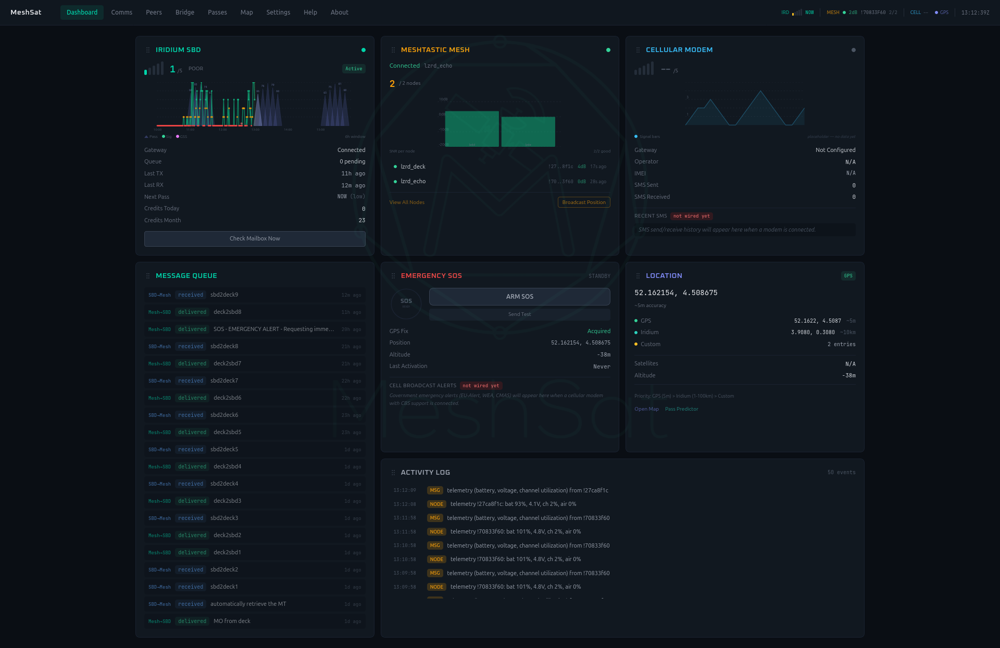
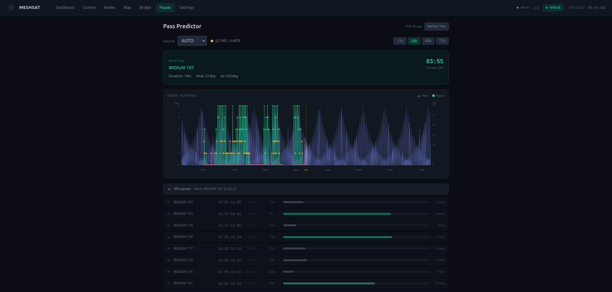
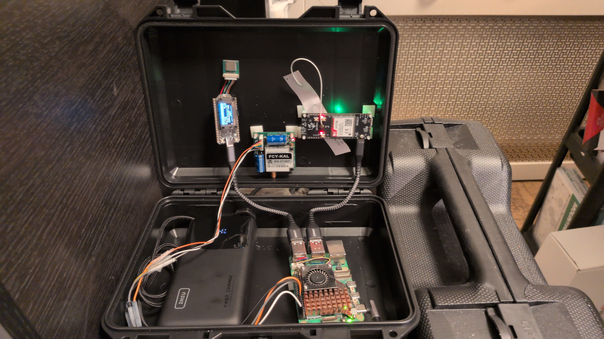
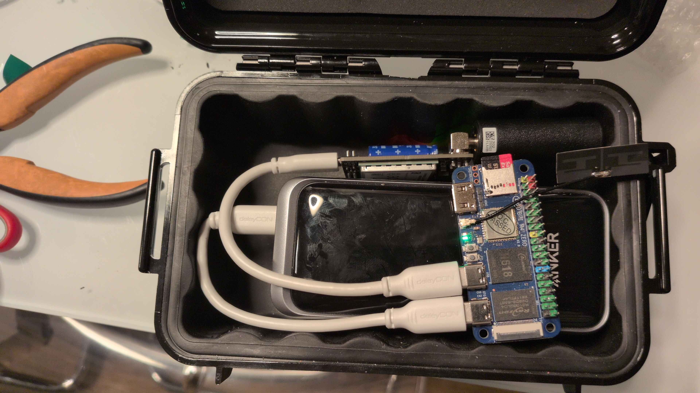

# MeshSat


[](LICENSE)


MeshSat is a multi-transport mesh and satellite gateway that bridges Meshtastic LoRa networks to satellite, cellular, and tactical data channels. Eleven transport types -- Meshtastic LoRa, Iridium SBD (9603N), Iridium IMT (9704), Astrocast LEO, Cellular SMS, ZigBee, MQTT, Webhooks, APRS, TAK (CoT XML), and direct serial -- are all available as routing destinations. A Reticulum-compatible routing layer with 10 cross-connected interfaces forwards packets between any transport pair with cost-aware path selection. Access rules route messages with per-rule filtering, failover groups, and transform pipelines.

MeshSat runs as a standalone Docker container on any Linux machine with USB-connected devices. No cloud dependencies, no subscriptions beyond your satellite or cellular plan.

For multi-tenant fleet management, see [MeshSat Hub](https://hub.meshsat.net). For the mobile companion app, see [MeshSat Android](https://github.com/cubeos-app/meshsat-android).

## Dashboard


*Built-in web dashboard showing satellite modem status, mesh nodes, delivery queue,
GPS/satellite positioning, and channel health scores*


*Satellite pass predictor with signal correlation --
optimizes transmission timing in obstructed environments*

## Features

### Transports
- **11 transports:** Meshtastic LoRa, Iridium SBD (9603N), Iridium IMT (9704, 100 KB messages), Astrocast LEO, Cellular SMS, ZigBee (Z-Stack ZNP), MQTT, Webhooks, APRS (Direwolf KISS), TAK (CoT XML), direct serial
- **Multi-instance gateways:** multiple modems of the same type on one bridge (e.g. 2x cellular), each with independent config and delivery workers
- **SBD/IMT decoupled:** separate SBDGateway and IMTGateway types with independent signal recording, pass scheduling, and delivery tracking
- **Full Meshtastic protocol** (~80%+ coverage) using official `buf.build/gen/go/meshtastic/protobufs` generated Go types

### Routing
- **Reticulum-compatible routing** with Ed25519 identity, announce relay, link manager, keepalive, bandwidth tracking, and resource transfers with chunked reliable delivery
- **10 Reticulum interfaces:** LoRa mesh, TCP/HDLC (RNS interop), Iridium SBD, Iridium IMT, Astrocast, AX.25/APRS, MQTT, SMS (planned), ZigBee (planned), BLE (planned)
- **TransportNode** with cost-aware cross-interface forwarding, PathFinder flooding-based route discovery, and 30-minute route TTL
- **Dispatcher** with failover groups, delivery ledger, per-channel workers, and visited-set loop prevention

### Compression & Transforms
- **3 compression tiers:** SMAZ2 (lossless, <1ms), llama-zip (LLM-based lossless, ~200ms), MSVQ-SC (lossy semantic, rate-adaptive)
- **Transform pipelines** per interface: compress (zstd, SMAZ2) + encrypt (AES-256-GCM) + encode (base64)

### Security
- **AES-256-GCM encryption** per channel with cross-platform key exchange via QR bundles (`meshsat://key/` URI scheme)
- **Master key envelope encryption** (HKDF + AES-256-GCM key wrapping) with device-derived or passphrase-based master key
- **Ed25519 signing service** with hash-chain audit log for tamper detection
- **Credential management:** upload ZIP/PEM certificates, encrypted storage, expiry monitoring, Hub-to-bridge distribution via MQTT

### Intelligence & Engine
- **Field intelligence:** Dead Man's Switch, geofence alerts, channel health scores, satellite burst queue, mesh topology visualization
- **Channel registry** with self-describing adapters and MTU awareness
- **Access rules engine** with object groups (node, portnum, sender, contact), rate limiting, and implicit deny
- **DeviceSupervisor** with USB hotplug detection, VID:PID identification cascade, and claim-based port management
- **Satellite pass prediction** using SGP4/TLE propagation with signal correlation
- **Config export/import** in YAML format (Cisco `show running-config` style), with config diff preview

### Dashboard & API
- **Web dashboard** (Vue.js SPA, 13 views) for monitoring, sending messages, Meshtastic radio configuration, mesh topology, and device management
- **REST API** with 280+ endpoints for integration
- **SSE events** for real-time dashboard updates
- **Auto-detects** USB devices on startup via VID:PID tables and protocol probing

### Ecosystem
- **Hub MQTT connection** with WSS + mTLS client certificates for fleet management, command handlers (ping, send_text, send_mt, flush_burst), and health telemetry reporting
- **Android companion app** ([meshsat-android](https://github.com/cubeos-app/meshsat-android)) with BLE mesh, SPP Iridium, SMS, MSVQ-SC, and AES-GCM
- **Multi-tenant fleet management** via [MeshSat Hub](https://hub.meshsat.net) (separate product)
- Runs on ARM64 (Raspberry Pi 5/4) and x86_64

## Hardware


*MeshSat field kit -- a self-contained, portable multi-transport gateway in a waterproof hard case.
Meshtastic and cellular are USB-connected; the RockBLOCK 9603 is UART-wired to the Pi 5 GPIO.
All devices are auto-detected on startup.*

| # | Component | Description |
|---|-----------|-------------|
| 1 | **Heltec LoRa V4** (ESP32-S3 + SX1262 + GPS) | Meshtastic mesh radio -- 868/915 MHz LoRa, OLED display, 2 MB PSRAM, 16 MB flash |
| 2 | **RockBLOCK 9603** (Iridium 9603N, SMA) | Iridium satellite modem -- SBD protocol, 340-byte MO buffer, UART via Pi 5 GPIO |
| 3 | **LILYGO T-Call A7670** (ESP32 + A7670E) | 4G LTE / 2G GSM cellular modem -- AT commands, SMS + data |
| 4 | **INIU 25000mAh** (100W USB-C PD) | Portable power bank -- powers all components via USB |
| 5 | **Raspberry Pi 5** (8 GB RAM) | MeshSat Bridge host -- standalone mode, Debian Bookworm |


*MeshSat compact kit -- minimal two-transport gateway (mesh + satellite) in a pocket-sized waterproof case.*

| # | Component | Description |
|---|-----------|-------------|
| 1 | **XIAO ESP32-S3 + SX1262 LoRa Module** | Meshtastic mesh radio -- 868/915 MHz, WiFi + BLE, ultra-compact form factor |
| 2 | **RockBLOCK 9704** (Iridium IMT, SMA) | Iridium satellite modem -- JSPR protocol, 100 KB messages, FTDI USB |
| 3 | **Anker Prime 20,000mAh** (200W, 2x USB-C + USB-A) | Portable power bank -- powers all components via USB-C |
| 4 | **Raspberry Pi 5** (8 GB RAM) | MeshSat Bridge host -- standalone mode, Ubuntu Server |

### Supported Devices

| Category | Device | Status | Notes |
|----------|--------|--------|-------|
| **Meshtastic** | Heltec LoRa V4 (ESP32-S3 + SX1262 + GPS) | Tested | 868/915 MHz, OLED, 2 MB PSRAM, 16 MB flash |
| | XIAO ESP32-S3 + SX1262 LoRa Module | Tested | 868/915 MHz, ultra-compact, WiFi + BLE |
| | Lilygo T-Echo (nRF52840) | Tested | 915 MHz, USB-C, e-ink display |
| | Lilygo T-Deck | Tested | ESP32-S3, keyboard, screen |
| | Espressif / CH340 / CP2102 / Nordic devices | Should work | Auto-detected via USB VID:PID |
| **Satellite** | RockBLOCK 9603 (Iridium 9603N) | Tested | SBD protocol, 340-byte MO, 19200 baud, UART or RS-232 |
| | RockBLOCK 9704 (Iridium IMT) | Tested | JSPR protocol, 100 KB messages, 230400 baud, FTDI USB |
| | Astrocast Astronode S | Code complete | ASCII hex frame protocol, fragmentation, pass prediction |
| **Cellular** | LILYGO T-Call A7670 (A7670E LTE) | Tested | 4G LTE / 2G GSM, AT commands, SMS + data |
| | SIM7600G-H (4G LTE) | Tested | USB modem, AT commands, SMS + data |
| | Huawei E220 (3G HSDPA) | Tested | USB modem, AT commands, SMS + data |
| **ZigBee** | SONOFF ZigBee 3.0 USB Dongle Plus (CC2652P) | Code complete | Z-Stack ZNP protocol, VID:PID auto-detect with ZNP probe |
| **Host** | Raspberry Pi 5 (8 GB) | Tested | ARM64, Debian Bookworm |
| | Raspberry Pi 4 (4 GB) | Tested | ARM64, Debian Bookworm |
| | BananaPi BPI-M4 Zero (4 GB + 32 GB eMMC) | Deprecated | Allwinner H618 USB unreliable -- not recommended |
| | Any x86_64 / ARM64 Linux | Should work | Docker + USB serial required |

## Quick Start

### Option A: One-liner with Docker

```bash
docker run -d \
  --name meshsat \
  --privileged \
  --network host \
  -e MESHSAT_MODE=direct \
  -e MESHSAT_PORT=6050 \
  -e MESHSAT_DB_PATH=/data/meshsat.db \
  -v meshsat-data:/data \
  -v /dev:/dev \
  -v /sys:/sys:ro \
  --restart unless-stopped \
  ghcr.io/cubeos-app/meshsat:latest
```

Open `http://<your-ip>:6050` in a browser to access the dashboard.

### Option B: Docker Compose

```yaml
services:
  meshsat:
    image: ghcr.io/cubeos-app/meshsat:latest
    container_name: meshsat
    restart: unless-stopped
    privileged: true
    network_mode: host
    environment:
      - MESHSAT_MODE=direct
      - MESHSAT_PORT=6050
      - MESHSAT_DB_PATH=/data/meshsat.db
    volumes:
      - meshsat-data:/data
      - /dev:/dev
      - /sys:/sys:ro

volumes:
  meshsat-data:
```

```bash
docker compose up -d
```

### Option C: Build from Source

```bash
git clone https://github.com/cubeos-app/meshsat.git
cd meshsat
make build-with-web    # Builds Vue SPA + Go binary
# Or with Docker:
docker compose -f docker-compose.direct.yml up --build
```

## Setup Guide

### Step 1: Plug in your devices

Connect your Meshtastic radio and/or satellite modem and/or cellular modem via USB. MeshSat will detect them automatically on startup using USB VID:PID tables and protocol probing (pure Go serial via `go.bug.st/serial`).

### Step 2: Start the container

Use one of the methods above. MeshSat will scan USB devices, connect to each one it finds via protocol-specific probing (Meshtastic protobuf, Iridium AT, ZNP for ZigBee), and start the web dashboard on port 6050.

### Step 3: Open the dashboard

Navigate to `http://<your-ip>:6050`. The dashboard provides 13 views: Dashboard, Messages (Comms), Nodes (Peers), Map, Passes, Bridge, Interfaces, Meshtastic (radio config), Topology, Settings, Audit, Help, and About.

### Step 4: Set up access rules

Create access rules in the Interfaces tab to route messages between transports. Rules support source/destination interface filtering, direction (ingress/egress/both), node/portnum/keyword/object group matching, SMS contact selection, failover groups, transform overrides, and rate limiting.

### Step 5: Verify end-to-end

Send a test message from your Meshtastic device. If access rules are configured, it should be delivered to the destination interface (e.g., appear in the RockBLOCK portal for Iridium, or arrive as an SMS for cellular).

## Configuration

All configuration is via environment variables. MeshSat works fine with just a single device connected -- missing devices are logged as warnings.

**Core:**

| Variable | Default | Description |
|----------|---------|-------------|
| `MESHSAT_MODE` | `cubeos` | Set to `direct` for standalone USB access |
| `MESHSAT_PORT` | `6050` | HTTP port for dashboard and API |
| `MESHSAT_DB_PATH` | `/data/meshsat.db` | SQLite database file path |
| `MESHSAT_RETENTION_DAYS` | `30` | Days to keep historical data |
| `MESHSAT_WEB_DIR` | *(empty)* | Override embedded SPA path (development only) |

**Serial ports** (`auto` = scan USB via VID:PID + protocol probing):

| Variable | Default | Description |
|----------|---------|-------------|
| `MESHSAT_MESHTASTIC_PORT` | `auto` | Meshtastic radio serial port |
| `MESHSAT_IRIDIUM_PORT` | `auto` | Iridium 9603N (SBD) serial port |
| `MESHSAT_IMT_PORT` | `auto` | RockBLOCK 9704 (IMT/JSPR) serial port |
| `MESHSAT_CELLULAR_PORT` | `auto` | Cellular modem serial port |
| `MESHSAT_ASTROCAST_PORT` | `auto` | Astrocast Astronode serial port |
| `MESHSAT_ZIGBEE_PORT` | `auto` | ZigBee coordinator serial port |

**Iridium 9603N:**

| Variable | Default | Description |
|----------|---------|-------------|
| `MESHSAT_IRIDIUM_SLEEP_PIN` | `0` | GPIO pin for 9603N sleep/wake (0 = disabled) |
| `IRIDIUM_SBDIX_TIMEOUT` | `90` | SBDIX AT command timeout in seconds |

**Rate limiting & routing:**

| Variable | Default | Description |
|----------|---------|-------------|
| `MESHSAT_PAID_RATE_LIMIT` | `60` | Minimum seconds between paid satellite sends |
| `MESHSAT_MAX_HOPS` | `8` | Maximum interfaces a message may traverse |
| `MESHSAT_MESH_WATCHDOG_MIN` | `10` | Minutes of silence before Meshtastic serial reconnect (0 = disabled) |

**Compression sidecars:**

| Variable | Default | Description |
|----------|---------|-------------|
| `MESHSAT_LLAMAZIP_ADDR` | *(empty)* | llama-zip gRPC sidecar address (empty = disabled) |
| `MESHSAT_LLAMAZIP_TIMEOUT` | `30` | llama-zip RPC timeout in seconds |
| `MESHSAT_MSVQSC_ADDR` | *(empty)* | MSVQ-SC gRPC sidecar address (empty = disabled) |
| `MESHSAT_MSVQSC_TIMEOUT` | `30` | MSVQ-SC RPC timeout in seconds |
| `MESHSAT_MSVQSC_CODEBOOK` | *(empty)* | Path to MSVQ-SC codebook file (enables pure-Go decode) |

**Reticulum interfaces** (all first-boot defaults, UI overrides via Settings > Routing):

| Variable | Default | Description |
|----------|---------|-------------|
| `MESHSAT_TCP_LISTEN` | *(empty)* | TCP listen address for RNS interop (e.g. `:4242`) |
| `MESHSAT_TCP_CONNECT` | *(empty)* | TCP remote RNS node address (legacy, prefer UI peers) |
| `MESHSAT_ANNOUNCE_INTERVAL` | `300` | Routing announce broadcast interval in seconds |
| `MESHSAT_AX25_KISS_ADDR` | *(empty)* | Direwolf KISS TNC address (e.g. `localhost:8001`) |
| `MESHSAT_AX25_CALLSIGN` | *(empty)* | AX.25 source callsign (e.g. `MESHSAT-1`) |
| `MESHSAT_MQTT_RETICULUM_BROKER` | *(empty)* | MQTT broker for Reticulum packets (e.g. `tcp://broker:1883`) |
| `MESHSAT_MQTT_RETICULUM_PREFIX` | `reticulum/meshsat` | MQTT topic prefix for RNS packets |

## Deployment Modes

| | Standalone mode | CubeOS mode |
|---|---|---|
| Set via | `MESHSAT_MODE=direct` | `MESHSAT_MODE=cubeos` (default) |
| Serial access | Direct to /dev/ttyACM0, /dev/ttyUSB0 | Via HAL REST API |
| Deploy with | `docker-compose.direct.yml` | CubeOS orchestrator |
| Who it's for | Any Linux machine | CubeOS installations |

For CubeOS mode, see [CubeOS docs](https://cubeos.app).

## Architecture

```
USB / UART / TCP       MeshSat Container                              Clients
------------------     -----------------------------------------------  ----------------
                       |                                             |
/dev/ttyACM0 -------->-|  DirectMeshTransport (Meshtastic)            |
  (Meshtastic)         |    Protobuf binary framing (buf.build)       |->  Web Dashboard
                       |                                             |    (Vue 3 SPA,
/dev/ttyUSB0 -------->-|  DirectSatTransport (Iridium 9603N)          |     13 views)
  (Iridium SBD)        |    AT commands, SBDIX/SBDSX, sleep/wake GPIO |
                       |                                             |->  REST API
Pi UART GPIO -------->-|  DirectIMTTransport (RockBLOCK 9704)         |    (280+ endpoints)
  (Iridium IMT)        |    JSPR protocol, 230400 baud, 100 KB msgs  |
                       |                                             |->  SSE Events
/dev/ttyUSB1 -------->-|  DirectCellTransport (A7670E / SIM7600G)     |    (real-time)
  (Cellular)           |    AT commands, SMS, data                    |
                       |                                             |->  MeshSat Hub
/dev/ttyUSB2 -------->-|  DirectAstrocastTransport (Astronode S)      |    (MQTT/WSS +
  (Astrocast)          |    ASCII hex frames, CRC-16, fragmentation  |     mTLS certs)
                       |                                             |
/dev/ttyUSB3 -------->-|  DirectZigBeeTransport (CC2652P)             |
  (ZigBee)             |    Z-Stack ZNP binary protocol              |
                       |                                             |
                       |  DeviceSupervisor                            |
                       |    USB hotplug, VID:PID cascade, port claims |
                       |                                             |
                       |  Compression Pipeline                        |
                       |    SMAZ2 | llama-zip | MSVQ-SC              |
                       |                                             |
                       |  Reticulum Routing (10 interfaces)           |
                       |    Ed25519 identity, announce relay, links   |
                       |    TransportNode, PathFinder, cost-aware     |
                       |    mesh|tcp|sbd|imt|astro|ax25|mqtt|...     |
                       |                                             |
                       |         InterfaceManager                     |
                       |           (state machine, bind/unbind)       |
                       |              |                               |
                       |         AccessEvaluator                      |
                       |           (rules, object groups, rates)      |
                       |              |                               |
                       |         Dispatcher                           |
                       |           (delivery workers per iface)       |
                       |              |                               |
                       |      TransformPipeline                       |
                       |        (zstd, smaz2, aes-256-gcm, b64)       |
                       |              |                               |
                       |  +--------+--------+--------+------+------+  |
                       |  |SBD     |IMT     |Cell    |MQTT  |APRS  |  |
                       |  |Gateway |Gateway |Gateway |GW    |GW    |  |
                       |  +--------+--------+--------+------+------+  |
                       |  |Astro   |ZigBee  |TAK     |Wbook |Fail- |  |
                       |  |Gateway |Gateway |Gateway |GW    |over  |  |
                       |  +--------+--------+--------+------+------+  |
                       |                                             |
                       |  Field Intelligence                          |
                       |    Dead Man's Switch, Geofence Alerts,       |
                       |    Health Scores, Burst Queue, Topology      |
                       |                                             |
                       |  KeyStore (QR bundles, master key envelope)  |
                       |  SigningService (Ed25519 hash chain)         |
                       |  CredentialManager (certs, expiry, mTLS)     |
                       |  Delivery Ledger (SQLite tracking)           |
                       |  SQLite DB (/data/meshsat.db, v37)           |
                       -----------------------------------------------
```

## Troubleshooting

**No devices detected on startup** -- Check that USB devices are visible (`ls /dev/ttyACM* /dev/ttyUSB*`). Try a different cable or port.

**Meshtastic connects but shows 0 nodes** -- Config handshake takes 5-10 seconds. Wait for "config complete" log line.

**Iridium signal shows 0 bars** -- Check antenna connections. Requires clear sky view.

**ZigBee dongle detected as Meshtastic** -- SONOFF ZigBee dongle shares VID:PID with some Meshtastic devices. Pin the port with `MESHSAT_ZIGBEE_PORT`.

## Roadmap

**v0.1.x** -- Iridium SBD + Meshtastic bridge with configurable rules engine, MQTT gateway, pass-aware scheduler, dead letter queue with ISU-aware backoff, device management, SOS mode, and full dashboard.

**v0.2.0** -- Any-to-any routing fabric. Channel registry, unified rules engine, structured dispatcher, Astrocast and cellular integration, SMAZ2 compression, ZigBee gateway, InterfaceManager with USB hotplug, object groups, failover groups, transform pipelines, Ed25519 audit log, config export/import.

**v0.3.0 (current)** -- 3-tier compression (SMAZ2 lossless, llama-zip LLM lossless, MSVQ-SC lossy semantic with rate-adaptive codebook). Reticulum-compatible routing with Ed25519 identity, announce relay, link manager, keepalive, bandwidth tracking, TCP/HDLC RNS interop, and 10 cross-connected interfaces. RockBLOCK 9704 IMT transport (100 KB messages, JSPR protocol). SBD/IMT decoupled into separate gateway types with independent signal recording. APRS and TAK gateways. DeviceSupervisor with USB hotplug and GatewayManager lifecycle wiring. Full Meshtastic protocol (~80%+ coverage, official protobuf bindings). Cross-platform key exchange (QR bundles, master key envelope encryption). Credential management with encrypted cert storage and Hub distribution. Hub MQTT connection (WSS + mTLS, command handlers, health telemetry). Multi-instance gateway support. Config diff preview endpoint. Field intelligence (dead man's switch, geofence, health scores, burst queue, topology). Android companion app.

**Next -- Protocol enhancements:**
- DTN concepts: custody transfer, bundle fragmentation, and late binding integrated into the delivery ledger (RFC 9171 inspired)
- Forward error correction (FEC): Reed-Solomon codec in the transform pipeline for noisy channels (LoRa, satellite)
- GPS-denied time synchronization: mesh clock consensus with stratum tracking, Iridium MSSTM and Hub NTP fallback
- Random linear network coding (RLNC): coded segments for resource transfer with 20-40% throughput gain on lossy multi-hop links

**Next -- New Reticulum interfaces:**
- SMS interface: Reticulum packets over cellular SMS
- ZigBee interface: Reticulum packets over ZigBee mesh
- BLE interface: Reticulum packets over Bluetooth Low Energy

**Next -- Spectrum awareness:**
- RTL-SDR jamming detection: wideband spectrum monitoring with baseline calibration, automatic transport failover on detected jamming

**Future** -- Federated mesh-of-meshes (multi-network auto-discovery), HF radio transport (NVIS/ALE for 300-600 km no-infrastructure range), DMR digital radio transport, cognitive radio with dynamic spectrum access, edge AI inference for message triage, hardware security module (HSM) integration.

## Related Projects

- **MeshSat Hub** -- Multi-tenant fleet management platform: [hub.meshsat.net](https://hub.meshsat.net)
- **MeshSat Android** -- Standalone mobile gateway app: [github.com/cubeos-app/meshsat-android](https://github.com/cubeos-app/meshsat-android)
- **CubeOS** -- Self-hosted OS for SBCs and edge devices: [cubeos.app](https://cubeos.app)

## Community

- GitHub: [github.com/cubeos-app/meshsat](https://github.com/cubeos-app/meshsat)
- Issues: Use GitHub Issues for bugs and feature requests

PRs welcome. See open issues for where help is needed.

## License

Copyright 2026 Nuclear Lighters Inc. Licensed under the [GNU General Public License v3.0](LICENSE).
